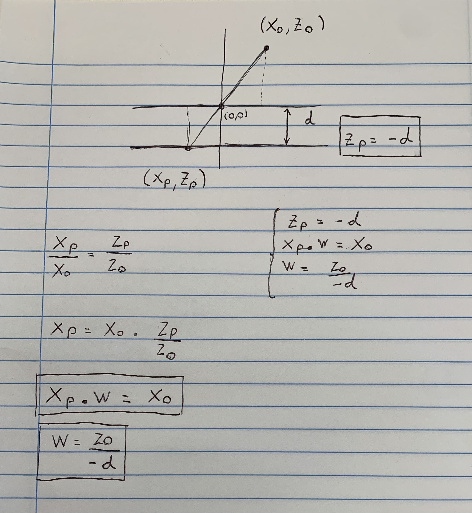
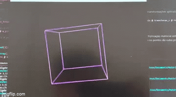

# 2D-cube-projection

## Descrição do modelo matemático do projeto
    
Matriz inicial do Cubo 3D

$$
cubo_3d = \begin{bmatrix}
X1 & X2 & X3 & X4 & X5 & X6 & X7 & X8\\
Y1 & Y2 & Y3 & Y4 & Y5 & Y6 & Y7 & Y8\\
Z1 & Z2 & Z3 & Z4 & Z5 & Z6 & Z7 & Z8\\
\end{bmatrix}
\hspace{0.5in}
$$
    
Matriz Final Desejada representação do Cubo 2D

$$
projecoes_2d = \begin{bmatrix}
X1p & X2p & X3p & X4p & X5p & X6p & X7p & X8p\\
Y1p & Y2p & Y3p & Y4p & Y5p & Y6p & Y7p & Y8p
\end{bmatrix}
\hspace{0.5in}
$$

<br>

### Chegando na Matriz de projeção

<br>
    
Objetivo: Para representar o cubo em 2D, é necessário encontrar as projeções Xp e YP das coordenadas de cada ponto do cubo 3D.

Passo 1: Encontrar as projeções Xp dos pontos do Cubo.

- Para isso vamos assumir um ponto genérico (Xo,Yo,Zo) do cubo.
- Como queremos encontrar apenas a projeção de X nesse momento, iremos imaginar que esse ponto não pode se movimentar no eixo y.
- Neste momento, vamos usar conhecimentos de geometria para simular uma câmera no espaço 2D - mais especificamente, o plano cartesiano $x,z$

* O *pinhole*, que é o buraco por onde a luz entra, ficará exatamente na origem do plano cartesiano, isto é, no ponto $[0,0]$.
* O anteparo está a uma distância $d$ do *pinhole*
* O anteparo ficará sobre a reta $z=-d$, que é a reta horizontal que passa pelo ponto $[0,-d]$.

Um ponto que está no ponto $[x_o,z_o]$ deverá ser projetado no anteparo no ponto $[x_p, z_p]$:

Onde, x_p será a nossa projeção de x desejada e z_p será constante e igual a -d.
    
<br>

### Encontrando um sistema linear, envolvendo o Xp.

<br>



<br>

### Sitema de equação considerando a projecao em X
* Como demonstrado na imagem chegamos no Sitema de equação considerando a projecao em X.

$$ 
\begin{cases}
    \begin{aligned}
    Zp & = -d \\
        W * Xp & = Xo \\
    W & = Zo / -d \\
    \end{aligned}
\end{cases}
$$

### Sitema de equação considerando a projecao em Y
* Para encontrar a projeção em Y podemos repetir o mesmo processo, encontraremos o Sitema de equação considerando a projecao em Y

$$ 
\begin{cases}
    \begin{aligned}
    Zp & = -d \\
        W * Yp & = Yo \\
    W & = Zo / -d \\
    \end{aligned}
\end{cases}
$$

### Sitema de equação considerando as projecoes em X e Y (2D)
* Com os dois sistemas, podemos selecionar apenas as equações que contenham a projeção Xp e yp, e o valor da incógnita W, que será necessária para encontrar os valores de Xp e Yp. Com isso montamos o Sitema de equação considerando as projecoes em X e Y (2D)

$$ 
\begin{cases}
    \begin{aligned}
    W * Xp & = Xo \\
    W * Yp & = Yo \\
    W & = Zo / -d \\
    \end{aligned}
\end{cases}
$$

### Representação matricial do sistema linear encontrado.

$$
Matriz Projecao = 
\begin{bmatrix}
    1 & 0 & 0 \\
    0 & 1 & 0 \\
    0 & 0 & -1/d
\end{bmatrix}
$$

$$
original = 
\begin{bmatrix}
    Xo \\
    Yo\\
    Zo
\end{bmatrix}
$$

$$
projecao = 
\begin{bmatrix}
    Xp * W \\
    Yp * W \\
       W
\end{bmatrix}
$$

<br>

$$
projecao = Matriz Projecao \cdot original
$$


### Aplicando a representação matricial, para o exemplo dos vértices de um Cubo 3D.

<br>

$$
cubo2D = \begin{bmatrix}
X1 & X2 & X3 & X4 & X5 & X6 & X7 & X8\\
Y1 & Y2 & Y3 & Y4 & Y5 & Y6 & Y7 & Y8\\
Z1 & Z2 & Z3 & Z4 & Z5 & Z6 & Z7 & Z8\\
\end{bmatrix}
\hspace{0.5in}
$$

$$
Matriz Projecao = 
\begin{bmatrix}
    1 & 0 & 0 \\
    0 & 1 & 0 \\
    0 & 0 & -1/d
\end{bmatrix}
$$

<br>

$$
cubo2D = cubo3D \cdot Matriz Projecao
$$

<br>

$$
cubo2D = \begin{bmatrix}
W * Xp1 & W * Xp2 & W * Xp3 & W * Xp4 & W * Xp5 & W * Xp6 & W * Xp7 & W * Xp8\\
W * Yp1 & W * Yp2 & W * Yp3 & W * Yp4 & W * Yp5 & W * Yp6 & W * Yp7 & W * Yp8\\
W & W & W & W & W & W & W & W\\
\end{bmatrix}
\hspace{0.5in}
$$

### Projeções em 2D encontradas

Dividindo a matriz cubo_2d por w chegamos na matriz projecoes_2d, onde estão as projeções possíveis para plotar o a projeção do cubo na plano 2D.

<br>

$$
projecoes2D = cubo2D / W
$$

<br>


$$
projecoes2D = \begin{bmatrix}
X1p & X2p & X3p & X4p & X5p & X6p & X7p & X8p\\
Y1p & Y2p & Y3p & Y4p & Y5p & Y6p & Y7p & Y8p\\
1 & 1 & 1 & 1 & 1 & 1 & 1 & 1
\end{bmatrix}
\hspace{0.5in}
$$

## Tansformações

### Matrizes de rotação 

$$
rotacao X = \begin{bmatrix}
1 & 0 & 0 & 0 \\
0 & cos(alfa) & -sin(alfa) & 0\\
0 & sin(alfa) & cos(alfa) & 0\\
0 & 0 & 0 & 1 
\end{bmatrix}
\hspace{0.5in}
$$

$$
rotacao Y = \begin{bmatrix}
cos(alfa) & 0 & sin(alfa) & 0 \\
0 & 1 & 0 & 0\\
-sin(alfa) & 0 & cos(alfa) & 0\\
0 & 0 & 0 & 1 
\end{bmatrix}
\hspace{0.5in}
$$

$$
rotacao Z = \begin{bmatrix}
cos(alfa) & -sin(alfa) & 0 & 0\\
sin(alfa) & cos(alfa) & 0 & 0 \\
0 & 0 & 1 & 0 \\
0 & 0 & 0 & 1 
\end{bmatrix}
\hspace{0.5in}
$$

<br>

## Explicando o código com base no modelo matemático

### Importando as bibliotecas

Primeiramente, precisávamos importar as bibliotecas necessárias para o desenvolvimento do projeto. Para isso, utilizamos a biblioteca **numpy** para trabalhar com matrizes e vetores, e **pygame** para a renderização gráfica do cubo.

```python
import numpy as np
import pygame
```

### Definindo variáveis importantes

Para que executássemos com sucesso o código, precisávamos definir algumas variáveis importantes para a construção das matrizes que seriam usadas na transformação do cubo:

<br>

- **d**: variável que armazena a distância "focal" da câmera, que é usada para a projeção do cubo no plano 2D.
Na renderização gráfica, a distância focal é definida como a distância entre o centro da tela e o centro da projeção do cubo no plano 2D. Essa variável precisa ser grande o suficiente para que o usuário consiga visualizar o cubo na tela, mas não muito grande para que o cubo não fique muito pequeno.

```python	
d = 700
```

<br>

- **angulo**: variável que armazena o ângulo de rotação do cubo em relação aos eixos. Esse valor é usado para a construção das matrizes de rotação, as quais dependem do valor do coseno e do seno do ângulo. No código, o ângulo é definido como 1 grau para que as transformações fossem feitas de forma suave ("lenta").

```python
angulo = 1
```

<br>

### Matrizes utilizadas no código

No código, utilizamos grande parte das matrizes que descrevemos no modelo matemático. Para facilitar a visualização, listamos abaixo as matrizes que foram utilizadas no código:

- **cubo**: esta matriz representa os pontos do cubo 3D

    ```python
    cubo = np.array([[-150, -150, -150, 1], [150, -150, -150, 1], 
    [150, 150, -150, 1], [-150, 150, -150, 1], 
    [-150, -150, 150, 1], [150, -150, 150, 1], 
    [150, 150, 150, 1], [-150, 150, 150, 1]]).T

    ```

    <br>
    Esta matriz, quando transposta, se torna a seguinte matriz:

    $$
    cubo = \begin{bmatrix}
    -150 & 150 & 150 & -150 & -150 & 150 & 150 & -150\\
    -150 & -150 & 150 & 150 & -150 & -150 & 150 & 150\\
    -150 & -150 & -150 & -150 & 150 & 150 & 150 & 150\\
    1 & 1 & 1 & 1 & 1 & 1 & 1 & 1
    \end{bmatrix}
    $$

    <br>

    Nesta matriz, cada coluna representa um ponto do cubo 3D. Por exemplo, a primeira coluna representa o ponto (-150, -150, -150), a segunda coluna representa o ponto (150, -150, -150), e assim por diante. A última linha é composta por 1's, pois caso contrário, a multiplicação das matrizes não seria possível.

    <br>

- **Matrizes de rotação**: estas matrizes são responsáveis por rotacionar o cubo em relação aos eixos.
    
    ```python

    # Rotação em relação ao eixo X
    rotacao_x = np.array([[1, 0, 0, 0], [0, np.cos(angulo), -np.sin(angulo), 0], 
    [0, np.sin(angulo), np.cos(angulo), 0], [0, 0, 0, 1]])

    # Rotação em relação ao eixo Y
    rotacao_y = np.array([[np.cos(angulo), 0, np.sin(angulo), 0], [0, 1, 0, 0], 
    [-np.sin(angulo), 0, np.cos(angulo), 0], [0, 0, 0, 1]])

    # Rotação em relação ao eixo Z
    rotacao_z = np.array([[np.cos(angulo), -np.sin(angulo), 0, 0],
    [np.sin(angulo), np.cos(angulo), 0, 0], [0, 0, 1, 0], [0, 0, 0, 1]])
    ```
    <br>

    - **rotacao_total**: matriz criada através da multiplicação matricial de todas as matrizes de rotação, resultando, portanto, em uma única matriz responsável por todo o movimento do cubo.

        ```python
        rotacao_total = rotacao_z @ rotacao_y @ rotacao_x
        ```

        No loop principal do código, esta matriz precisa ser atualizada a cada iteração, pois o ângulo de rotação é incrementado em 1 grau a cada iteração. Caso contrário, o cubo não iria se movimentar. Logo, dentro do loop principal, a matriz de rotação total é atualizada da seguinte forma:

        ```python
        rotacao_total = rotacao_total @ rotacao_z @ rotacao_y @ rotacao_x
        ```

        <br>

 - **translacao_z**: matriz responsável portransladar o cubo em relação ao eixo Z. Essa matrizé usada para que usuário consiga visualizar o cubo.

    <br>

     ```python
     translacao_z = np.array([[1, 0, 0, 0], [0, 1, 0,0], [0, 0, 1, d], [0, 0, 0, 1]])
     ```
     <br>
 - **translacao_centro**: matriz responsável por transladar o cubo para o centro da tela. Caso esta matriz não existisse, o cubo estaria presente no ponto (0,0), o qual na janela criada pela biblioteca pygame seria no canto superior esquerdo.

     ```python
     translacao_centro = np.array([[1, 0, 0, 400], [0, 1, 0, 300], 
     [0, 0, 1, 0], [0, 0, 0, 1]])
     ```

    Para transladar para o centro da janela do pygame, precisávamos transladar o cubo para o ponto (400, 300), pois a janela do pygame tem dimensões 800x600.

    <br>

 - **m_pinhole**: esta matriz equivale à matriz de projeção do modelo matemático. Ela é responsável por projetar o cubo no plano 2D.

     ```python
     m_pinhole = np.array([[1, 0, 0, 0], [0, 1, 0, 0], [0, 0, 0, -d], [0, 0, -(1/d), 0]])
     ```

    <br>

 - **M**: esta matriz representa todas as transformações aplicadas sobre o cubo:

    ```python
    M = translacao_centro @ m_pinhole @ translacao_z @ rotacao_total
    ```

    <br>
 - **final**: matriz final, resultante da multiplicação matricial entre a matriz M e a matriz cubo. Esta matriz representa os pontos do cubo projetados no plano 2D.

    ```python
    final = M @ cubo
    ```

    <br>

Após aplicar todas as transformações necessárias no cubo utilizando as matrizes descritas no bloco acima e desenhar as linhas do cubo que ligam todos os pontos definidos na matriz **cubo**, conseguimos gerar com sucesso um cubo 3D rotacionando em 3 dimensões e projetado em 2D:

<br>


        